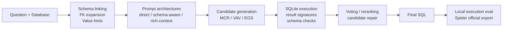

# NL2SQL L20


Reproducible natural-language-to-SQL fine-tuning and multi-path inference benchmarks on
public Spider/BIRD data using `Qwen2.5-Coder-7B-Instruct` and one NVIDIA L20 GPU.

## TL;DR

This repo benchmarks NL2SQL fine-tuning and multi-path inference on Spider/BIRD using
`Qwen2.5-Coder-7B-Instruct` on one NVIDIA L20. Best Spider result: `82.20%` official
execution accuracy with retrospective VAV n=4 selection from a saved n=30 candidate pool.
Best BIRD Mini-Dev transfer result: `46.40%` execution accuracy with fresh VAV n=16
generation. The repo is positioned as a single-L20 research-engineering benchmark, not
as a claimed Text-to-SQL SOTA system.

## Headline Results

| Track | Best Run | Metric | Evidence |
| --- | --- | ---: | --- |
| Spider dev | `VAV-SQL-L20` n=4 retrospective selector | 82.20% official EX | Spider evaluator stdout checked in |
| Spider dev | `VAV-SQL-L20` n=30 full generation | 82.11% local EX / 81.90% official EX | full 1,034-example dev split |
| BIRD Mini-Dev | `VAV-SQL-L20` n=16 fresh generation | 46.40% local EX | full 500-example Mini-Dev split |
| Training efficiency | schema-aware Spider LoRA | 73.22% dense MFU | single NVIDIA L20 run |

## System Overview



## Metric Notes

- `Execution Acc` is the main metric for BIRD Mini-Dev in this repo. BIRD SQL surface
  forms vary heavily, so the strict normalized-string EM is reported for transparency but
  is not the primary transfer metric here.
- Local `Normalized EM` is strict string normalization from this repo. Spider official
  `Exact Match` is the upstream parsed structure-level evaluator. They are intentionally
  reported separately and should not be compared as the same metric.
- BIRD Mini-Dev results are out-of-domain transfer from Spider-trained adapters. They are
  not BIRD leaderboard submissions and are not directly comparable to full systems using
  different data, retrievers, proprietary models, or test-time budgets.

## Result Snapshot

Latest validated result snapshot: `2026-05-14 18:35 +08:00`.

| Benchmark | Examples | Model / Adapter | Architecture | Input Context | Candidates / Example | Eval Scope | Normalized EM | Execution Acc |
| --- | ---: | --- | --- | --- | ---: | --- | ---: | ---: |
| Spider dev | 1,034 | Qwen2.5-Coder-7B-Instruct + Spider LoRA | `direct` | full schema | 1 | local SQLite evaluator | 48.94% | 75.73% |
| Spider dev | 1,034 | Qwen2.5-Coder-7B-Instruct + Spider LoRA | `schema_aware` | linked schema + FK hints + evidence | 1 | local SQLite evaluator | 48.65% | 76.40% |
| Spider dev | 1,034 | Qwen2.5-Coder-7B-Instruct + Spider LoRA | `rich_context` | full schema + M-Schema + value hints | 1 | local SQLite evaluator | 50.48% | 78.72% |
| Spider dev | 1,034 | Qwen2.5-Coder-7B-Instruct + Spider LoRA | `MCR-SQL-L20` | multi-prompt rich context | 8 | local SQLite evaluator | 51.06% | 80.37% |
| Spider dev | 1,034 | Qwen2.5-Coder-7B-Instruct + Spider LoRA | `VAV-SQL-L20` | value-aware multi-prompt voting | 30 | local SQLite evaluator | 52.03% | 82.11% |
| Spider dev | 1,034 | Qwen2.5-Coder-7B-Instruct + Spider LoRA | `VAV-SQL-L20` cost curve | retrospective balanced subset from n=30 candidates | 4 | local SQLite evaluator | 50.39% | 82.59% |
| Spider dev | 1,034 | Qwen2.5-Coder-7B-Instruct + Spider LoRA | `EGS-SQL-L20` | execution-guided schema rerank | 32 | local SQLite evaluator | 51.06% | 81.33% |
| BIRD Mini-Dev | 500 | Qwen2.5-Coder-7B-Instruct + Spider LoRA | `direct` | full schema | 1 | local SQLite evaluator | 0.80% | 21.60% |
| BIRD Mini-Dev | 500 | Qwen2.5-Coder-7B-Instruct + Spider LoRA | `schema_aware` | linked schema + FK hints + evidence | 1 | local SQLite evaluator | 1.20% | 37.40% |
| BIRD Mini-Dev | 500 | Qwen2.5-Coder-7B-Instruct + Spider LoRA | `rich_context` | full schema + M-Schema + value hints | 1 | local SQLite evaluator | 0.60% | 37.20% |
| BIRD Mini-Dev | 500 | Qwen2.5-Coder-7B-Instruct + Spider LoRA | `MCR-SQL-L20` | multi-prompt rich context | 8 | local SQLite evaluator | 0.60% | 39.20% |
| BIRD Mini-Dev | 500 | Qwen2.5-Coder-7B-Instruct + Spider LoRA | `Candidate-Repair-SQL-L20` | MCR candidates + learned repair adapter | 8 repaired | local SQLite evaluator | 1.20% | 42.20% |
| BIRD Mini-Dev | 500 | Qwen2.5-Coder-7B-Instruct + Spider LoRA | `VAV-SQL-L20` | value-aware multi-prompt voting | 12 | local SQLite evaluator | 1.80% | 45.40% |
| BIRD Mini-Dev | 500 | Qwen2.5-Coder-7B-Instruct + Spider LoRA | `VAV-SQL-L20` | value-aware multi-prompt voting | 16 | local SQLite evaluator | 1.00% | 46.40% |
| BIRD Mini-Dev | 500 | Qwen2.5-Coder-7B-Instruct + Spider LoRA | `EGS-SQL-L20` | execution-guided schema rerank | 16 | local SQLite evaluator | 0.80% | 41.40% |

The Spider numbers above are local normalized exact match and SQLite execution accuracy,
not official leaderboard numbers. For the current best retrospective `VAV-SQL-L20` n=4
candidate subset, the upstream Spider evaluator stdout is checked in and reports `82.20%`
execution accuracy and `78.10%` official exact match. The n=32 EGS run is also checked in
as a selector ablation: it reaches `82.00%` official execution accuracy, but does not beat
the VAV cost curve. The official exact match is a parsed Spider metric and is not directly
comparable to this repo's strict normalized-string EM.

BIRD Mini-Dev is intentionally shown as out-of-domain transfer from Spider-trained
adapters. The best current BIRD Mini-Dev run is fresh `VAV-SQL-L20` n=16 generation at
46.40% execution accuracy. This is a clear robustness gain over direct transfer and a
competitive Mini-Dev result for a local 7B + single-L20 setup, but it is still not a BIRD
leaderboard claim; the next work item is learned candidate selection and better value
grounding.

The claim boundary is deliberate: this is a strong single-L20 research-engineering
benchmark repo, not a claimed Text-to-SQL SOTA system. Spider is the mature benchmark
where the pipeline is already competitive; BIRD transfer remains the main research gap.

The first experiment keeps the base model fixed:

- Base model: `Qwen/Qwen2.5-Coder-7B-Instruct`
- Hardware target: 1x L20, LoRA fine-tuning with an MFU target above `0.60`
- Benchmark target: Spider 1.0 first, BIRD / BIRD Mini-Dev next
- Comparison: same model and training data, different input architecture

## Why This Repo

The goal is not to publish another generic LoRA notebook. The goal is to build a
repeatable NL2SQL benchmark repo:

- public benchmark preparation
- direct vs schema-aware architecture comparison
- rich schema/value retrieval and multi-path inference
- LoRA / QLoRA training configs sized for an L20
- inference output files
- normalized exact match and SQLite execution comparison
- export format for the official Spider evaluator
- checked-in official Spider evaluator stdout and inference cost notes for the best run
- retrospective candidate-budget curves for cost-aware inference comparison

## Quick Start: Reproduce Spider Dev Evaluation

This path checks the repo and reruns local evaluation from a saved prediction file. It
does not require retraining.

```bash
python3 -m venv .venv
source .venv/bin/activate
pip install -e ".[dev]"
PYTHONPATH=src python3 -m nl2sql_l20.evaluate \
  --gold data/processed/spider_dev.jsonl \
  --pred evals/sota/rich_context_spider_qwen25_coder_7b_l20_mfu/spider_dev_vav_n30/predictions.jsonl \
  --out evals/recheck/spider_dev_vav_n30_results.json \
  --execute
```

Expected local result: about `82.11%` Spider dev execution accuracy for the saved n=30
VAV predictions. To reproduce the official Spider metric, export `gold.txt` and
`pred.txt` with `nl2sql-export-spider`, then run the upstream Spider evaluator.

## Architectures

### `direct`

The model sees:

```text
Database
Dialect
Full schema
Question
```

This is the baseline.

### `schema_aware`

The model sees:

```text
Database
Dialect
Evidence
Relevant schema hints
Full schema with foreign keys
Question
```

The current schema linker is deliberately simple and reproducible. It matches question
tokens against table and column names, then expands through foreign keys. This gives us a
clean first comparison before adding learned retrieval or value linking.

### `rich_context`

The model sees an M-Schema style representation, matched database values, evidence, and
question-linked schema hints. This is the stronger training target for BIRD-style tasks.

### `MCR-SQL-L20`

The research-oriented path is a multi-candidate pipeline using the same base model
through several prompt architectures:

```text
rich_context + decompose + query_plan + skeleton -> execution grouping -> selected SQL
```

See [docs/SOTA_ARCHITECTURE.md](docs/SOTA_ARCHITECTURE.md).

### `EGS-SQL-L20`

The execution-accuracy ablation adds an `execution_first` prompt and an execution-guided
schema reranker:

```text
rich_context + execution_first + query_plan + skeleton -> safe execution -> schema/value/operator rerank
```

The first EGS benchmark is `spider_dev_egs_n32`: 32 candidates per example, same
rich-context LoRA adapter, same Spider dev split. It reduces schema hallucination more
than VAV, but trails the best VAV execution accuracy.

### `Candidate-Repair-SQL-L20`

The post-training repair run adds a learned repair adapter on top of the same
Qwen2.5-Coder-7B base model. It trains from Spider train candidate contexts generated by
the rich-context LoRA, then evaluates on Spider dev and BIRD Mini-Dev candidate sets.

```text
multi-prompt candidates + execution/schema/value feedback -> candidate_repair LoRA
-> safety gate -> fallback to execution-guided candidate
```

This is designed to improve execution accuracy without using BIRD Mini-Dev as training
data. On BIRD Mini-Dev it improves transfer accuracy from the 39.20% MCR baseline to
42.20%, but it does not beat value-aware voting.

## Benchmarks

Recommended order:

1. Spider 1.0 for fast public reproducibility.
2. BIRD Mini-Dev for harder SQLite execution checks.
3. BIRD full dev when you have the database files locally.
4. LiveSQLBench later, because it is closer to current industrial workloads but needs a
   longer-context pipeline.

Official references:

- [Spider official site](https://yale-lily.github.io/spider)
- [Spider official GitHub evaluator](https://github.com/taoyds/spider)
- [BIRD official site](https://bird-bench.github.io/)
- [LiveSQLBench dataset card](https://huggingface.co/datasets/birdsql/livesqlbench-base-full-v1)
- [Qwen2.5-Coder model overview](https://qwen2.org/qwen2-5-coder/)

## Current Results

Completed L20 training runs:

| Experiment | Output / Checkpoint | Tail tokens/sec | Tail dense MFU | MFU target |
| --- | --- | ---: | ---: | ---: |
| `direct_spider_qwen25_coder_7b_l20_mfu` | `outputs/direct_spider_qwen25_coder_7b_l20_mfu` | 1725.46 | 0.6598 | met |
| `schema_aware_spider_qwen25_coder_7b_l20_mfu` | `outputs/schema_aware_spider_qwen25_coder_7b_l20_mfu` | 1914.90 | 0.7322 | met |
| `rich_context_spider_qwen25_coder_7b_l20_mfu` | `outputs/rich_context_spider_qwen25_coder_7b_l20_mfu/checkpoint-96` | 1734.91 | 0.6634 | met |
| `candidate_repair_spider_qwen25_coder_7b_l20_mfu` | `outputs/candidate_repair_spider_qwen25_coder_7b_l20_mfu` | 1614.37 | 0.6173 | met |

Spider dev results:

| Architecture | Normalized EM | Execution Acc | Executable Rate | Exec Error Rate | Schema Hallucination |
| --- | ---: | ---: | ---: | ---: | ---: |
| `direct` single-path | 48.94% | 75.73% | 94.68% | 5.32% | 4.74% |
| `schema_aware` single-path | 48.65% | 76.40% | 95.26% | 4.74% | 3.77% |
| `rich_context` single-path | 50.48% | 78.72% | 95.16% | 4.84% | 3.87% |
| `MCR-SQL-L20` multi-path | 51.06% | 80.37% | 98.07% | 1.93% | 1.74% |
| `VAV-SQL-L20` n=30 voting | 52.03% | 82.11% | 99.61% | 0.39% | 0.58% |
| `EGS-SQL-L20` n=32 rerank | 51.06% | 81.33% | 99.61% | 0.39% | 0.19% |

The current best full-generation Spider run is `VAV-SQL-L20` n=30, which improves
execution accuracy by `+3.39` points over rich-context single-path and `+1.74` points
over the 8-candidate MCR run. It reduces execution errors to `4` and schema
hallucinations to `6` on the full 1,034-example Spider dev split. The retrospective
cost curve below finds an even better n=4 balanced subset from that saved n=30 candidate
pool.

Official Spider evaluator for `VAV-SQL-L20`:

| Run | Exact Match | Execution Acc | Easy EX | Medium EX | Hard EX | Extra EX |
| --- | ---: | ---: | ---: | ---: | ---: | ---: |
| n=30 full VAV | 78.50% | 81.90% | 92.30% | 86.50% | 70.70% | 65.70% |
| n=4 retrospective balanced subset | 78.10% | 82.20% | 91.50% | 86.30% | 74.10% | 65.70% |
| n=32 EGS rerank | 78.40% | 82.00% | 93.50% | 86.10% | 71.30% | 65.10% |

The n=4 result is a retrospective re-selection from the saved n=30 candidate pool, not a
fresh n=4 generation run. It shows that most of the gain comes from candidate diversity
and selection quality rather than raw candidate count. The official stdout files are
saved under
`evals/sota/rich_context_spider_qwen25_coder_7b_l20_mfu/spider_dev_vav_cost_curve/*/spider_official/`.
The EGS official stdout is saved under
`evals/sota/rich_context_spider_qwen25_coder_7b_l20_mfu/spider_dev_egs_n32/spider_official/`.

EGS is useful as a negative selector ablation. It cuts schema hallucinations to `2` on
Spider dev, but the extra execution-guided reranking does not improve execution accuracy
over the simpler VAV selection. This supports the next direction: learned candidate
selection or repair rather than adding more hand-written rerank terms.

VAV candidate-budget curve:

| Budget | Local EX | Official EX | Official EM | Estimated wall-clock on one L20 |
| ---: | ---: | ---: | ---: | ---: |
| 4 | 82.59% | 82.20% | 78.10% | 19:47 |
| 8 | 82.30% | 82.00% | 78.60% | 39:34 |
| 12 | 82.21% | 82.00% | 78.10% | 59:21 |
| 16 | 82.30% | 82.00% | 78.40% | 1:19:08 |
| 30 | 82.11% | 81.90% | 78.50% | 2:28:23 |

BIRD Mini-Dev results:

| Architecture | Normalized EM | Execution Acc | Executable Rate | Exec Error Rate | Schema Hallucination |
| --- | ---: | ---: | ---: | ---: | ---: |
| `direct` single-path | 0.80% | 21.60% | 80.00% | 20.00% | 12.40% |
| `schema_aware` single-path | 1.20% | 37.40% | 85.00% | 15.00% | 8.40% |
| `rich_context` single-path | 0.60% | 37.20% | 83.40% | 16.60% | 10.80% |
| `MCR-SQL-L20` multi-path | 0.60% | 39.20% | 93.20% | 6.80% | 4.80% |
| `Candidate-Repair-SQL-L20` | 1.20% | 42.20% | 95.60% | 4.40% | 2.40% |
| `VAV-SQL-L20` n=12 voting | 1.80% | 45.40% | 97.80% | 2.20% | 2.00% |
| `VAV-SQL-L20` n=16 voting | 1.00% | 46.40% | 98.20% | 1.80% | 1.60% |
| `EGS-SQL-L20` n=16 rerank | 0.80% | 41.40% | 98.00% | 2.00% | 1.20% |

The best BIRD Mini-Dev run is fresh `VAV-SQL-L20` n=16 generation at 46.40% execution
accuracy. It improves execution accuracy by `+24.80` points over direct transfer,
`+7.20` points over the 8-candidate MCR run, `+4.20` points over candidate repair, and
`+1.00` point over the earlier n=12 VAV run. It also cuts execution errors from `16.60%`
on rich-context single-path to `1.80%`.

The EGS n=16 run is a useful negative result: it lowers schema hallucination to `1.20%`
and execution errors to `2.00%`, but its execution accuracy falls to 41.40%. This
suggests that the current execution-guided reranker is too conservative for BIRD and
that future gains should come from learned selection/value grounding rather than stronger
hand-written safety penalties.

Comparison boundaries:

- These are same-base-model comparisons inside this repo, not fair comparisons against
  DIN-SQL, DAIL-SQL, C3, MAC-SQL, CHESS, CHASE-SQL, or other full systems.
- Spider rows use the prepared full database schema. Schema-aware rows add linked schema,
  foreign-key expansion, and evidence. Rich-context rows additionally use M-Schema text,
  matched values, evidence fields when present, and question-linked schema hints.
- `direct`, `schema_aware`, and `rich_context` use one generation per example.
  `MCR-SQL-L20` currently uses 8 candidate generations per example in
  `configs/pipeline_mcr_l20.yaml`. `VAV-SQL-L20` uses 30 candidate generations per
  example for Spider and 16 candidate generations per example for the best completed
  BIRD Mini-Dev follow-up.
- The VAV cost curve is retrospective: it re-selects from the saved n=30 candidate file
  with balanced per-architecture candidate budgets. It is valid as a cost/selector
  analysis, while fresh lower-budget generation runs are still useful for runtime
  confirmation.
- Official Spider evaluator export files are saved, but the README reports this repo's
  local normalized EM and SQLite execution metrics in the main tables. The best VAV run
  additionally includes checked-in upstream Spider evaluator stdout.
- VAV is an accuracy-oriented inference configuration. Its cost is 30 candidate
  generations per example, 31,020 total candidates for Spider dev, and 2:28:23 wall-clock
  time on one L20 for the full 1,034-example split.

Artifacts already saved in the repo snapshot:

- `evals/after_train/direct_spider_qwen25_coder_7b_l20_mfu/spider_dev/results.json`
- `evals/after_train/direct_spider_qwen25_coder_7b_l20_mfu/spider_dev/predictions.jsonl`
- `evals/after_train/direct_spider_qwen25_coder_7b_l20_mfu/bird_mini_dev/results.json`
- `evals/after_train/direct_spider_qwen25_coder_7b_l20_mfu/bird_mini_dev/predictions.jsonl`
- `evals/after_train/direct_spider_qwen25_coder_7b_l20_mfu/summary.json`
- `outputs/direct_spider_qwen25_coder_7b_l20_mfu/perf.summary.json`
- `evals/after_train/schema_aware_spider_qwen25_coder_7b_l20_mfu/spider_dev/results.json`
- `evals/after_train/schema_aware_spider_qwen25_coder_7b_l20_mfu/spider_dev/predictions.jsonl`
- `evals/after_train/schema_aware_spider_qwen25_coder_7b_l20_mfu/bird_mini_dev/results.json`
- `evals/after_train/schema_aware_spider_qwen25_coder_7b_l20_mfu/bird_mini_dev/predictions.jsonl`
- `evals/after_train/schema_aware_spider_qwen25_coder_7b_l20_mfu/summary.json`
- `outputs/schema_aware_spider_qwen25_coder_7b_l20_mfu/perf.summary.json`
- `evals/after_train/rich_context_spider_qwen25_coder_7b_l20_mfu/spider_dev/results.json`
- `evals/after_train/rich_context_spider_qwen25_coder_7b_l20_mfu/spider_dev/predictions.jsonl`
- `evals/after_train/rich_context_spider_qwen25_coder_7b_l20_mfu/spider_dev_mcr/results.json`
- `evals/after_train/rich_context_spider_qwen25_coder_7b_l20_mfu/spider_dev_mcr/predictions.jsonl`
- `evals/sota/rich_context_spider_qwen25_coder_7b_l20_mfu/spider_dev_vav_n30/results.json`
- `evals/sota/rich_context_spider_qwen25_coder_7b_l20_mfu/spider_dev_vav_n30/predictions.jsonl`
- `evals/sota/rich_context_spider_qwen25_coder_7b_l20_mfu/spider_dev_vav_n30/spider_official/evaluation_stdout.txt`
- `evals/sota/rich_context_spider_qwen25_coder_7b_l20_mfu/spider_dev_vav_n30/cost_summary.json`
- `evals/sota/rich_context_spider_qwen25_coder_7b_l20_mfu/spider_dev_vav_cost_curve/summary.json`
- `evals/sota/rich_context_spider_qwen25_coder_7b_l20_mfu/spider_dev_egs_n32/results.json`
- `evals/sota/rich_context_spider_qwen25_coder_7b_l20_mfu/spider_dev_egs_n32/spider_official/evaluation_stdout.txt`
- `evals/sota/candidate_repair_spider_qwen25_coder_7b_l20_mfu/spider_dev_repair/results.json`
- `evals/sota/candidate_repair_spider_qwen25_coder_7b_l20_mfu/bird_mini_dev_repair/results.json`
- `evals/sota/rich_context_spider_qwen25_coder_7b_l20_mfu/bird_mini_dev_vav_n12/results.json`
- `evals/sota/rich_context_spider_qwen25_coder_7b_l20_mfu/bird_mini_dev_vav_n16/results.json`
- `evals/sota/rich_context_spider_qwen25_coder_7b_l20_mfu/bird_mini_dev_egs_n16/results.json`
- `outputs/candidate_repair_spider_qwen25_coder_7b_l20_mfu/perf.summary.json`
- `logs/remote_l20_sota_spider_vav_20260513_192853.log`
- `evals/after_train/rich_context_spider_qwen25_coder_7b_l20_mfu/summary.json`
- `outputs/rich_context_spider_qwen25_coder_7b_l20_mfu/perf.summary.json`

## Setup

```bash
python3 -m venv .venv
source .venv/bin/activate
pip install -e ".[train,dev]"
```

For the L20 utilization target, install the optional perf kernels on the CUDA machine:

```bash
pip install -e ".[train,perf,dev]"
```

## Prepare Spider

Download Spider 1.0 from the official site and unpack it under `data/raw/spider`, or pass
the unpacked path explicitly:

```bash
bash scripts/prepare_spider.sh data/raw/spider
```

This writes:

```text
data/processed/spider_train_no_value_hints.jsonl
data/processed/spider_dev.jsonl
```

## Prepare BIRD Mini-Dev

Download and unpack the BIRD Mini-Dev SQLite package so that
`mini_dev_sqlite.json` and `dev_databases/` are under the same directory, then run:

```bash
bash scripts/prepare_bird.sh data/raw/bird_mini_dev/minidev/MINIDEV mini_dev
```

This writes:

```text
data/processed/bird_mini_dev.jsonl
```

The prepared records include schema links, evidence, M-Schema text, database paths, and
matched value hints for BIRD Mini-Dev execution evaluation.

## Train

Direct baseline:

```bash
bash scripts/train_direct_l20.sh
```

Schema-aware run:

```bash
bash scripts/train_schema_aware_l20.sh
```

Rich-context run:

```bash
bash scripts/train_rich_context_l20.sh
```

L20 high-throughput run with MFU logging:

```bash
bash scripts/probe_l20_mfu.sh
bash scripts/train_rich_context_l20_mfu.sh
```

The MFU logs are written under the experiment output directory as `perf.jsonl` and
`perf.summary.json`. See [docs/L20_MFU.md](docs/L20_MFU.md).

Deploy to the L20 server, upload project files and prepared Spider data, then start
probe + train + validation:

```bash
SSHPASS='your-password' bash scripts/deploy_l20_train_val.sh
```

The script defaults to `hhai@100.111.150.63:22` over Tailscale and
`/home/hhai/nl2sql-l20`.

The baseline scripts support QLoRA, but the current high-throughput L20 run in this repo
uses BF16 LoRA with SDPA attention and Liger kernels. The effective batch size is
`6 * 5 = 30` for `configs/experiment_rich_context_spider_l20_mfu.yaml`.

By default, the training scripts run [configs/benchmarks_after_train.yaml](configs/benchmarks_after_train.yaml)
after the adapter is saved. Missing benchmark JSONL files are skipped, so you can start
with Spider and add BIRD/LiveSQLBench later.

Disable the automatic benchmark stage:

```bash
RUN_BENCHMARKS=0 bash scripts/train_rich_context_l20.sh
```

Run the suite manually:

```bash
bash scripts/run_benchmarks_after_train.sh \
  configs/experiment_rich_context_spider.yaml \
  outputs/rich_context_spider_qwen25_coder_7b
```

## Infer And Evaluate

```bash
bash scripts/infer_eval_spider.sh \
  configs/experiment_schema_aware_spider.yaml \
  outputs/schema_aware_spider_qwen25_coder_7b \
  evals/schema_aware_spider_predictions.jsonl \
  evals/schema_aware_spider_results.json
```

The local evaluator reports:

- prediction presence rate
- normalized exact match
- SQLite execution accuracy when `db_path` exists
- executable rate and execution error rate
- schema hallucination rate
- missing predictions
- execution errors

For the official Spider evaluator:

```bash
nl2sql-export-spider \
  --gold-jsonl data/processed/spider_dev.jsonl \
  --pred-jsonl evals/schema_aware_spider_predictions.jsonl \
  --out-dir evals/spider_official
```

Then run `evaluation.py` from `taoyds/spider` with the generated `gold.txt` and `pred.txt`.

Multi-path pipeline:

```bash
bash scripts/run_mcr_spider.sh \
  configs/pipeline_mcr_l20.yaml \
  outputs/rich_context_spider_qwen25_coder_7b \
  evals/mcr_spider_predictions.jsonl \
  evals/mcr_spider_results.json
```

## Expected Repo Direction

The first meaningful result should be a table like this:

| Base model | Architecture | Benchmark | Normalized EM | Execution Acc |
| --- | --- | --- | ---: | ---: |
| Qwen2.5-Coder-7B-Instruct | direct | Spider dev | 48.94% | 75.73% |
| Qwen2.5-Coder-7B-Instruct | schema_aware | Spider dev | 48.65% | 76.40% |
| Qwen2.5-Coder-7B-Instruct | rich_context | Spider dev | 50.48% | 78.72% |
| Qwen2.5-Coder-7B-Instruct | MCR-SQL-L20 | Spider dev | 51.06% | 80.37% |
| Qwen2.5-Coder-7B-Instruct | VAV-SQL-L20 | Spider dev | 52.03% | 82.11% |
| Qwen2.5-Coder-7B-Instruct | VAV-SQL-L20 cost curve n=4 | Spider dev | 50.39% | 82.59% |
| Qwen2.5-Coder-7B-Instruct | direct | BIRD Mini-Dev | 0.80% | 21.60% |
| Qwen2.5-Coder-7B-Instruct | schema_aware | BIRD Mini-Dev | 1.20% | 37.40% |
| Qwen2.5-Coder-7B-Instruct | rich_context | BIRD Mini-Dev | 0.60% | 37.20% |
| Qwen2.5-Coder-7B-Instruct | MCR-SQL-L20 | BIRD Mini-Dev | 0.60% | 39.20% |
| Qwen2.5-Coder-7B-Instruct | VAV-SQL-L20 n=16 | BIRD Mini-Dev | 1.00% | 46.40% |

## Evidence And Limits

- **MCR Efficiency**: On the full 1,034-example Spider dev split, the MCR selector
  improves execution accuracy from 78.72% to 80.37%, reduces execution errors from 50 to
  20, and reduces schema hallucinations from 40 to 18. The cost is 8 candidate generations
  per example rather than 1.
- **VAV Accuracy**: On the same Spider dev split, n=30 value-aware voting reaches 82.11%
  execution accuracy, with 99.61% executable rate and 0.58% schema hallucination rate. The
  official Spider evaluator reports 81.90% execution accuracy and 78.50% exact match. The
  cost is 30 candidate generations per example, 31,020 total candidates, and 2.47 L20
  GPU-hours for the full Spider dev run.
- **Cost Curve**: Retrospective balanced re-selection from the saved n=30 candidate pool
  shows n=4 reaches 82.20% official Spider execution accuracy with an estimated 19:47
  one-L20 runtime. This motivates fewer candidates plus a smarter selector as the next
  accuracy/cost direction.
- **Hardware Optimization**: The completed L20 runs maintain up to 73.22% dense MFU in
  this repo's training setup, demonstrating strong single-L20 training efficiency in this
  experimental setup.
- **Current Gap**: BIRD Mini-Dev direct transfer is weak at 21.60% execution accuracy,
  and VAV n=16 improves it to 46.40%. This is a meaningful single-L20 transfer result,
  but the remaining gap is still mostly value grounding, database-specific schema
  linking, and learned candidate selection rather than raw executability.

See [docs/ERROR_ANALYSIS.md](docs/ERROR_ANALYSIS.md),
[docs/REPRODUCIBILITY.md](docs/REPRODUCIBILITY.md),
[docs/RESEARCH_POSITIONING.md](docs/RESEARCH_POSITIONING.md),
[docs/INFERENCE_COST.md](docs/INFERENCE_COST.md), and
[docs/ABLATIONS.md](docs/ABLATIONS.md) for the evidence chain and planned controls.

## 未来方向 / Future Directions

The current improvement path is BIRD value grounding, learned candidate selection,
pairwise selector training, and then optional execution-reward tuning. Each step should
stay as a separate architecture so the same base model comparison stays clean. EGS and
candidate repair are useful controls, but the latest results suggest that BIRD gains are
more likely to come from better candidate diversity and selector learning than from more
hand-written safety penalties.
