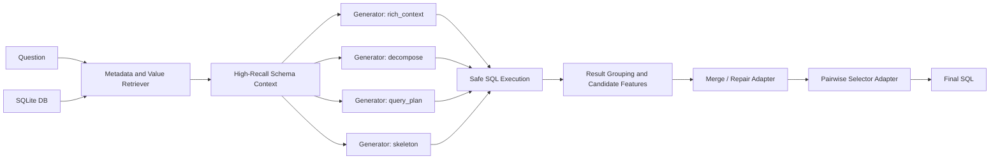

# SOTA Architecture Direction

This repo should aim for a competitive 7B open-model NL2SQL system, not a single-pass
fine-tuned model. With one L20, the right target is:

```text
same 7B base model + multiple LoRA adapters + retrieval + execution-aware test-time compute
```

The working name is `MCR-SQL-L20`: Metadata, Candidates, Repair.

## Why A Single Adapter Is Not Enough

Recent high-performing systems do not win because their base model alone is better. They
win because they reduce the search space before generation, generate diverse candidates,
and use execution feedback or a trained selector to choose the best SQL.

The key design implication: keep `Qwen/Qwen2.5-Coder-7B-Instruct` fixed, but use the base
model in multiple roles.

## Pipeline



## Module 1: Metadata And Value Retrieval

Use the database before asking the model to write SQL.

Inputs:

- schema tables, columns, types, primary keys, foreign keys
- benchmark evidence when available
- values matched from the database
- optionally column descriptions from BIRD metadata

Output:

- M-Schema style context
- linked tables/columns
- matched values by column
- full schema fallback when it fits

Principle: do not hard-prune too aggressively. Wrong schema pruning permanently removes
the answer. The safer pattern is high-recall selected context plus compressed full-schema
fallback.

Current repo status:

- `m_schema_text` is generated during preparation.
- `value_hints` are collected from local SQLite files.
- `rich_context` uses both fields.

## Module 2: Multi-Path Candidate Generation

Use one base model and one adapter, but ask it through several reasoning views:

- `rich_context`: M-Schema + matched values + evidence
- `decompose`: internally split question into subgoals
- `query_plan`: table scans, joins, predicates, grouping, order, projection
- `skeleton`: generate a SQL skeleton first, then fill schema items
- `execution_first`: explicitly optimize for executable SQLite, conservative joins, and
  schema-grounded filters

This borrows the robust part of multi-generator systems without requiring several large
models on one L20. The first implementation is in `nl2sql_l20.pipeline`.

## Module 3: Execution-Aware Selection

For every candidate:

- extract SQL only
- reject invalid SQL
- execute safely on SQLite
- group candidates by result signature
- prefer executable candidates with repeated result signatures

This is a lightweight selector. It should later be replaced by a pairwise selector adapter
trained from candidate pairs:

```text
question + schema + sql_a + features_a + sql_b + features_b -> A | B
```

The pairwise setup matters because SOTA systems usually select among plausible SQLs, not
just classify a single SQL as correct.

The `EGS-SQL-L20` selector is the current heuristic upgrade before a learned selector. It
scores candidates by:

- executable SQL first;
- no hallucinated tables or qualified columns;
- repeated result signature and repeated SQL;
- question/operator fit, such as `count`, `avg`, `sum`, `distinct`, and order/limit;
- matched value hints appearing in the SQL;
- prompt-priority tie breakers.

The first EGS run is `spider_dev_egs_n32`, using 4 prompt architectures and 8 samples per
architecture.

## Module 4: Merge / Repair Adapter

The repair adapter sees:

- question
- schema context
- top two candidate SQLs
- execution results or errors
- candidate disagreement summary

It returns one corrected SQL. This is more useful than generic self-correction because it
can merge two semantically different plausible candidates.

Training data can be generated from the train split:

1. sample multiple candidates from the SFT model
2. execute candidates
3. label successful candidates by execution match against gold
4. create pairwise selector data and repair data from failed/successful candidate pairs

## Module 5: RL Or Preference Optimization

Full GRPO is expensive, but still possible in a reduced form. The L20-friendly path is:

1. SFT generator on Spider + BIRD + high-quality synthetic data.
2. DPO/ORPO selector or repair adapter from candidate pairs.
3. Optional short GRPO on BIRD train with execution reward and format reward.

Rewards:

- SQL parses and executes
- result matches gold on train databases
- no hallucinated table or column
- concise SQL
- efficiency penalty for obviously wasteful queries

## Training Ladder

Do not jump straight to the full system. Run ablations:

| Stage | System | Purpose |
| --- | --- | --- |
| A0 | direct SFT | base control |
| A1 | rich_context SFT | measure metadata/value gain |
| A2 | MCR pipeline with one sample per path | measure test-time architecture gain |
| A3 | MCR with 2-4 samples per path | measure self-consistency gain |
| A4 | EGS heuristic reranker | add schema/value/operator features before learned selection |
| A5 | pairwise selector adapter | replace heuristic selector |
| A6 | merge/repair adapter | handle candidate disagreement |
| A7 | optional GRPO | optimize execution accuracy directly |

## What Would Count As Strong

Realistic milestones:

- Spider dev: beat the direct SFT baseline by a clear margin.
- BIRD Mini-Dev: show execution accuracy lift from value hints and multi-path generation.
- BIRD dev: competitive with open 7B systems, then improve with selector/repair.

Overall leaderboard SOTA against GPT-4o multi-agent systems is not a one-L20 training
target. A credible open 7B system is.
