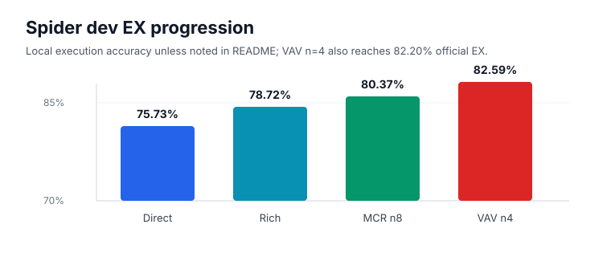
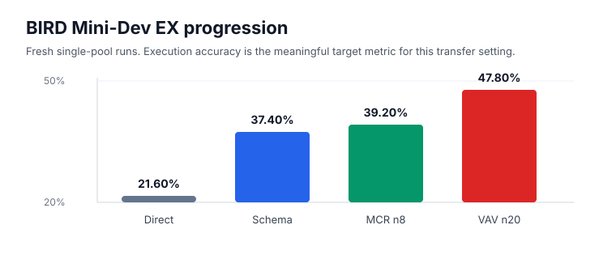
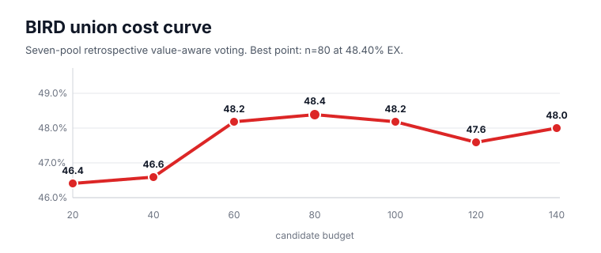

# NL2SQL L20 Technical Report

## Abstract

This report summarizes a single-GPU NL2SQL benchmark built around
`Qwen2.5-Coder-7B-Instruct`, LoRA fine-tuning, and inference-time candidate selection.
The project studies how far a Spider-trained 7B model can be pushed without additional
pretraining. The best Spider dev result is `82.20%` official execution accuracy from a
retrospective n=4 value-aware voting subset. The best fresh BIRD Mini-Dev result is
`47.80%` execution accuracy from value-aware voting with 20 candidates at temperature
`0.9`. A seven-pool retrospective BIRD union reaches `48.40%` execution accuracy at an
n=80 candidate budget.

## Core Research Question

The project asks:

> Given a single NVIDIA L20, a 7B open model, and Spider supervision, how much NL2SQL
> quality can be recovered through schema-rich prompting and inference-time candidate
> selection rather than more pretraining?

This framing is intentionally resource-constrained. The goal is not to claim public
leaderboard SOTA, but to produce a reproducible engineering benchmark for studying
candidate selection, execution feedback, and out-of-domain transfer.

## Method

### Base Model and Training

- Base model: `Qwen2.5-Coder-7B-Instruct`
- Fine-tuning: LoRA adapters
- Hardware target: one NVIDIA L20
- Training data: Spider-style supervised text-to-SQL data
- Evaluation targets: Spider dev and BIRD Mini-Dev

The training variants differ mainly in input representation:

| Adapter family | Input representation |
| --- | --- |
| Direct | question plus database schema |
| Schema-aware | linked schema, foreign-key hints, and evidence |
| Rich-context | schema hints, M-Schema style text, value hints, and evidence |
| Candidate repair | repair examples derived from generated candidate pools |

### Inference Strategies

The benchmark compares direct decoding with several candidate-selection strategies:

| Strategy | Description |
| --- | --- |
| Direct | one SQL candidate from one prompt family |
| MCR | multi-candidate reranking from rich-context prompts |
| VAV | value-aware voting over multiple prompt families and samples |
| EGS | execution-guided schema reranking |
| Candidate repair | learned adapter repairs generated candidates |
| Union cost curve | retrospective selection over saved candidate pools at different budgets |

### Evaluation

The local evaluator reports:

- `EM`: strict normalized exact match;
- `EX`: SQLite execution accuracy;
- `Err`: execution-error rate;
- `Hall`: schema hallucination rate.

For Spider, selected runs are also exported to the upstream official evaluator. For BIRD,
execution accuracy is the primary metric because equivalent SQL can differ strongly in
surface form, making strict EM especially brittle in out-of-domain transfer.

## Experiment Summary

### Spider Dev

| Run | Candidates | Local EM | Local EX | Official EM | Official EX |
| --- | ---: | ---: | ---: | ---: | ---: |
| Direct | 1 | 48.94% | 75.73% | - | - |
| Schema-aware | 1 | 48.65% | 76.40% | - | - |
| Rich-context | 1 | 50.48% | 78.72% | - | - |
| MCR | 8 | 51.06% | 80.37% | - | - |
| VAV full pool | 30 | 52.03% | 82.11% | 78.50% | 81.90% |
| VAV cost curve | 4 | 50.39% | 82.59% | 78.10% | 82.20% |
| EGS | 32 | 51.06% | 81.33% | 78.40% | 82.00% |
| Candidate repair | repaired | 50.10% | 81.14% | - | - |

The strongest official Spider result is the n=4 VAV retrospective subset. It is notable
because it beats the n=30 full-pool official EX while using a smaller selected budget,
suggesting that candidate quality and selection are more important than raw candidate
count after a certain point.

### BIRD Mini-Dev

| Run | Candidates / temp | EM | EX | Err | Hall |
| --- | --- | ---: | ---: | ---: | ---: |
| Direct | 1 | 0.80% | 21.60% | 20.00% | 12.40% |
| Schema-aware | 1 | 1.20% | 37.40% | 15.00% | 8.40% |
| Rich-context | 1 | 0.60% | 37.20% | 16.60% | 10.80% |
| MCR | 8 | 0.60% | 39.20% | 6.80% | 4.80% |
| Candidate repair baseline | repaired | 1.20% | 42.20% | 4.40% | 2.40% |
| EGS | n=16 | 0.80% | 41.40% | 2.00% | 1.20% |
| VAV | n=16 | 1.00% | 46.40% | 1.80% | 1.60% |
| VAV | n=20 default | 0.60% | 46.80% | 2.00% | 1.60% |
| VAV | n=20, temp 0.9 | 0.80% | 47.80% | 1.60% | 1.40% |
| VAV | n=20, temp 0.85 | 1.00% | 47.20% | 2.00% | 2.20% |
| VAV | n=20, temp 0.92 | 1.00% | 45.00% | 2.00% | 2.00% |
| VAV repeat | n=20, temp 0.9b | 0.80% | 45.60% | 2.20% | 1.60% |
| VAV repeat | n=20, temp 0.9c | 1.20% | 45.20% | 2.40% | 2.60% |
| Value-grounded VAV | n=20, temp 0.9 | 1.00% | 45.20% | 2.60% | 2.40% |

The strongest fresh BIRD result is VAV n=20 at temperature `0.9`, with `47.80%` EX.
The low EM should not be read as a failure of execution quality. It reflects strict
string matching under a cross-domain transfer setting where SQL forms can diverge while
still producing the correct answer.

### Retrospective BIRD Union

The best retrospective BIRD result uses a seven-pool union:

| Budget | EX |
| ---: | ---: |
| n=20 | 46.40% |
| n=40 | 46.60% |
| n=60 | 48.20% |
| n=80 | 48.40% |
| n=100 | 48.20% |
| n=120 | 47.60% |
| n=140 | 48.00% |

This result is best treated as verifier/reranker development evidence. It shows that the
saved pools contain complementary correct candidates, but that a better selector is
needed to convert those candidates into a fresh deployable improvement.

## Figures







## Ablations and Findings

### Schema and Context

Rich-context prompting improves Spider single-candidate EX from `75.73%` to `78.72%`.
For BIRD, schema-aware prompting improves EX from `21.60%` to `37.40%`, showing that
schema and evidence formatting matter strongly for out-of-domain transfer.

### Candidate Selection

MCR and VAV are the main performance levers. On Spider, MCR n=8 reaches `80.37%` local
EX and VAV reaches the best official result. On BIRD, VAV n=20 at temperature `0.9`
reaches `47.80%` EX, well above direct and MCR baselines.

### Temperature and Diversity

Temperature sweeps show a narrow optimum around `0.9` for the fresh BIRD run. Additional
independent `0.9` pools do not beat the best fresh pool, but they add useful candidates
for retrospective union analysis.

### Candidate Repair

Candidate repair is a negative BIRD ablation in this snapshot. It lowers some error and
hallucination rates but reduces EX relative to VAV. This suggests that the repair adapter
is overfitting to Spider-style repairs or changing semantically correct candidates.

### Value-Grounded Prompts

The BIRD-specific value-grounded prompt set does not improve the best fresh BIRD result.
It remains useful as a diagnostic because it tests whether more explicit evidence and
join-path prompting can recover failures without changing the model.

## Limitations

- This is not a public leaderboard submission.
- BIRD Mini-Dev is an evaluation proxy, not the full hidden BIRD benchmark.
- Retrospective union results use saved candidate pools and should not be compared to
  fresh single-run generation.
- BIRD EM is low because the model is Spider-supervised and because strict SQL string
  matching is brittle under equivalent-query variation.
- The project does not include additional pretraining, larger models, proprietary
  inference, or external production-grade retrievers.

## Reproducibility

The repository includes saved predictions, result JSON files, official Spider evaluator
stdout for key runs, and unit tests. A no-GPU sanity check is:

```bash
python3 -m pytest tests/
```

Expected result for this snapshot:

```text
25 passed
```

The main README contains full artifact links and commands for benchmark-suite runs,
cost-curve generation, and Spider official export.

## Conclusion

The experiments support a practical conclusion: for resource-constrained NL2SQL systems,
well-instrumented inference-time candidate selection can be as important as the adapter
itself. The strongest next research direction is not more repeated sampling by itself,
but a better verifier or reranker trained against the saved candidate pools.
